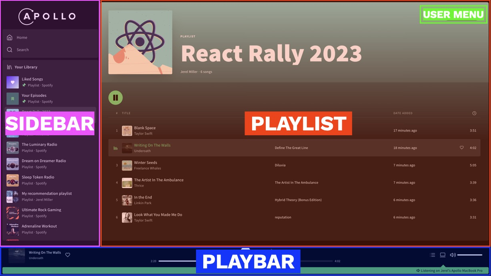

# Apollo Client Suspense Talk 2023
## By Jerel Miller ([@jerelmiller](https://github.com/jerelmiller)) and Alessia Bellisario ([@alessbell](https://github.com/alessbell))

## Table of Contents

- [Slides](#slides)
- [Spotify Showcase](#spotify-showcase)
- [Getting Started with Apollo Client and React Suspense](#getting-started-with-apollo-client-and-react-suspense)

## Slides

- [React Rally 2023](./react-rally-2023-slides/Suspense+GraphQL--ReactRally2023.pdf)
- [RVA.js 2023](./rvajs-2023-slides/RVAJS-Conference-2023.pdf)

## Spotify Showcase

https://github.com/apollographql/spotify-showcase

## Getting Started with Apollo Client and React Suspense

View the documentation: https://www.apollographql.com/docs/react/data/suspense